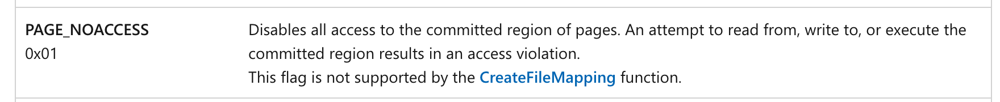

其实早在2020年就有一篇关于如何规避内存扫描的文章出来👉[Bypassing Windows Defender Runtime Scanning](https://labs.withsecure.com//blog/bypassing-windows-defender-runtime-scanning/)

奈何笔者当时水平有限，能理解它的意思，能看懂它的伪代码，但就是实现不出来，我可以简单介绍一下这篇文章所涉及到的技术以及其作者的想法。

在这篇文章中，作者认为的杀软引擎大致可分为2类：静态扫描引擎和内存/运行时扫描引擎。

对于静态扫描我们能很简单的理解：通过扫描磁盘文件，分析文件或某块文件的二进制部分是否命中了病毒特征库；而动态扫描（其实也就是内存扫描），则是会在3个阶段会唤起杀软对文件及文件运行的实例程序的内存地址进行扫描，分别是：在文件进行读和写时（我们在保存beacon以及编辑shellcode的时候就会碰到这样的问题），周期性扫描（有时扫描引擎会在后台进行周期性扫描）和敏感行为检测（调用了一些被重点观测的黑名单API函数）。

其实绕过静态扫描是非常简单的，只需对shellcode进行加密，就能使操作码面目全非，然后在内存中执行这段操作码前进行解密即可；另种可行的办法就是进行内存注入，比较典型的就是[mortar](https://github.com/0xsp-SRD/mortar)就是采用加密后的文件在内存中载入解密器对文件进行解密。

相比较静态扫描，动态扫描更加严格。作者通过分析meterpreter源码发现实际上是通过CreateProcess这个API函数来创建新进程的，在进行debug跟踪时，发现在调用CreateUserProcess后会接着调用syscall。其实也就是说，即使在用户态上不存在任何的钩子去hook函数，当我们去调用一些特别的API函数时，杀软会在内核态上进行hook，并且对调用这个API函数的内存块拉起扫描，这也是之前提到的第三点：敏感行为检测。

那如何规避敏感行为检测呢？常规方法有2种：不去使用敏感的特殊API函数，例如CreateProcess或是CreateRemoteThread等（之前有实现过通过将shellcode加密成uuid的形式，然后通过UuidToString的函数来还原加载shellcode，就是利用了不在黑名单里的API函数，但是现在好像也进黑名单了2333），另一种是当检测到扫描时添加一些指令或是动态加解密。

然后就是作者提出的一个想法：通过动态地改变内存块的属性（RWX）或是设置PAGE_NOACCESS属性来使杀软没有权限去进行一个扫描。于是当我们在调用一个敏感API接口的时候立马将内存块设置为PAGE_NOACCESS的状态，那么杀软就无法扫描内存块中的内容。

> **PAGE_NOACCESS**
>
> Microsoft docs 给出的解释是不允许任何的读、写和执行操作
>
> 

因此完成一次执行和规避需要几个步骤：

1. 安装一个钩子去探测敏感函数被调用时杀软的触发的hook
2. 当敏感函数触发了杀软的hook时，将shellcode挂起
3. 设置shellcode内存块的属性为PAGE_NOACCESS
4. 等待扫描结束
5. 设置shellcode内存块的属性为RWX
6. 拉起线程继续执行

之后就是作者实现的一些伪代码，感兴趣可以去原文看看，我就不过多赘述了，而ShellcodeFluctuation则是对这种方法的C语言实现，我来具体分析ShellcodeFluctuation的代码实现。

